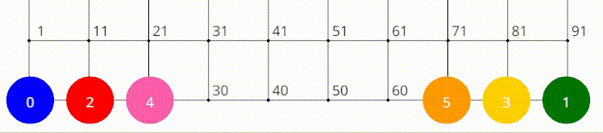

# cbs

[](https://github.com/vcoppe/cbs/actions?query=workflow%3A%22Rust%22)
[](https://codecov.io/gh/vcoppe/cbs)


A library implementating the *Continuous Conflict-Based Search* algorithm (CCBS) for the *Multi-Agent Path Finding* problem (MAPF), but **generic**, **parallel** and in **Rust**.



This algorithm was introduced and improved in the following papers:

[1] [*Multi-Agent Pathfinding with Continuous Time*](https://doi.org/10.24963/ijcai.2019/6) by Anton Andreychuk, Konstantin Yakovlev, Dor Atzmon and Roni Stern.

[2] [*Improving Continuous-time Conflict Based Search*](https://doi.org/10.1609/aaai.v35i13.17338) by Anton Andreychuk, Konstantin Yakovlev, Eli Boyarski and Roni Stern.

[3] [*Multi-Agent Pathfinding with Continuous Time*](https://doi.org/10.1016/j.artint.2022.103662) by Anton Andreychuk, Konstantin Yakovlev, Pavel Surynek and Roni Stern.

The original C++ implementation is available at [PathPlanning/Continuous-CBS](https://github.com/PathPlanning/Continuous-CBS).

CCBS uses the *Safe Interval Path Planning* algorithm (SIPP) under the hood to plan individual paths, avoid already processed collisions. This algorithm was introduced in:

[4] [*SIPP: Safe interval path planning for dynamic environments*](https://doi.org/10.1109/ICRA.2011.5980306) by Mike Phillips and Maxim Likhachev.

The library is tested on maps and scenarios from the [benchmarks provided by the Moving AI Lab](https://movingai.com/benchmarks/mapf/index.html).


## Features

Some improvements described in [1] have been implemented.
- [x] Disjoint splitting
- [x] Prioritizing conflicts
- [ ] High-level heuristics

The *conflict avoidance table* mechanism described in [*A Conflict Avoidance Table for Continuous Conflict-Based Search*](https://doi.org/10.1609/socs.v15i1.21780) could further speed up the search for environments in which many paths with equal costs exist.
- [ ] Conflict avoidance table

Other interesting features include:
- [x] Parallel implementation
- [x] Lifelong wrapper of the algorithm
- [ ] Handling additional resources (e.g. lifts)

## Installation

This library uses the [Rust](https://www.rust-lang.org/) programming language.
To install it, read the [Installation](https://doc.rust-lang.org/book/ch01-01-installation.html) section of [The Rust Programming Language](https://doc.rust-lang.org/book/index.html) online book.

Building the library should then be as easy as writing:
```
cargo build --release
```
And running the demo:
```
cargo run --release --example simple
```

